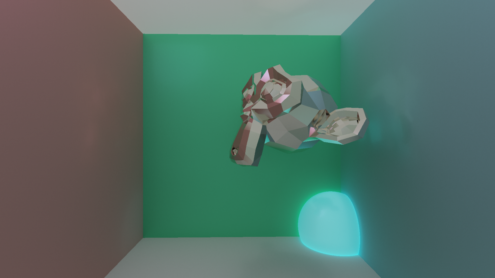

# Godot raytracer

My first coding attempt with glsl shaders and godot :)

Still very rough

## What works (or at least I think it does)

- Rendering spheres (wow)
- Loading vertices, normals and triangles from scene models
- Rendering triangles (double wow)
- Basic BVH generation
- Reflections, surface roughness, colors, light emission

## What I still want to add

- Actually handling normals
- Textures
- More optimization
- Transparency / glass / whatever (maybe)

## Ultra super cool showcase

*The raytracer can produce mind-boggling effects*